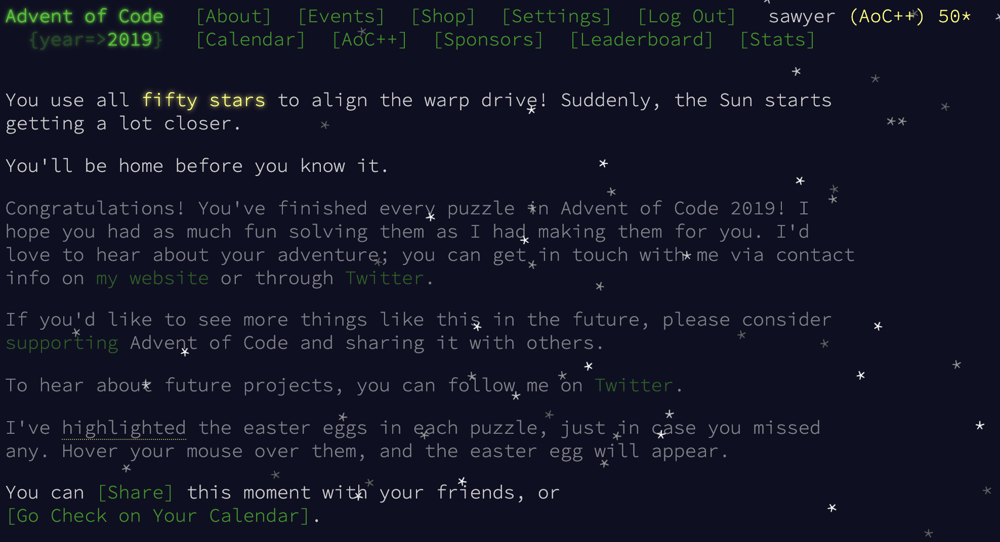

# Aoc2019

This was my first Advent of Code, and I used it to learn and practice Elixir!

I wrote and ran the first ~17 days or so as scripts, and then to take advantage
of mix packages I turned it into a proper project where each day is a module. 
Debugging Intcode programs with an actual elixir shell was much easier, so 
I'm glad I made that transition and will start next year's AOC with a proper 
project structure!

```
$ iex -S mix

iex> Aoc2019.Day25.p1
```

I found Day 18 the most challenging - learning to write a few different versions 
of BFS and performing multiple rounds of optimizations to solve the puzzle 
in a reasonable amount of time was a lot of fun!



